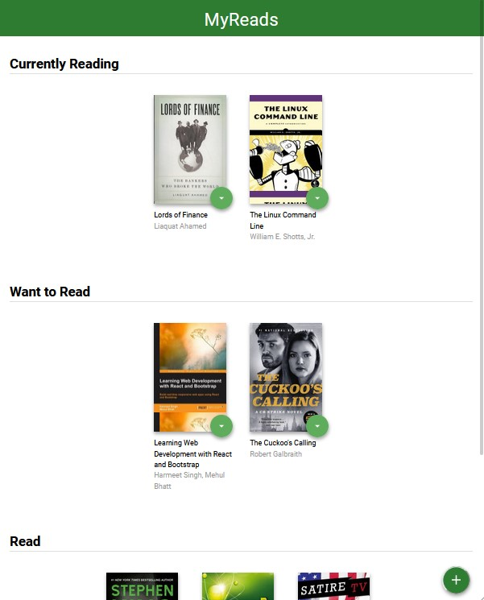

# MyReads: A Book Tracking Web App
A React web app created for Udacity's React Nanodegree program.

## About
This represents a virtual bookcase to track what you're reading, want to read, and what you already read.
It has three shelves:
- Currently Reading
- Want to Read
- Read

## Installation
- Clone/Download this repo.
- Run `npm install` or `yarn install` to install dependencies.
- Run it with `npm start` or `yarn start`

## Building
A starter template and a [`backend API`](src/BooksAPI.js) was provided to get book information and long term storage.
I refactored the static code into react components, following DOT (Do One Thing) rule.

---------
## [Live DEMO](https://myreads-egfwd-ahmed.netlify.app/)
## DEMO

